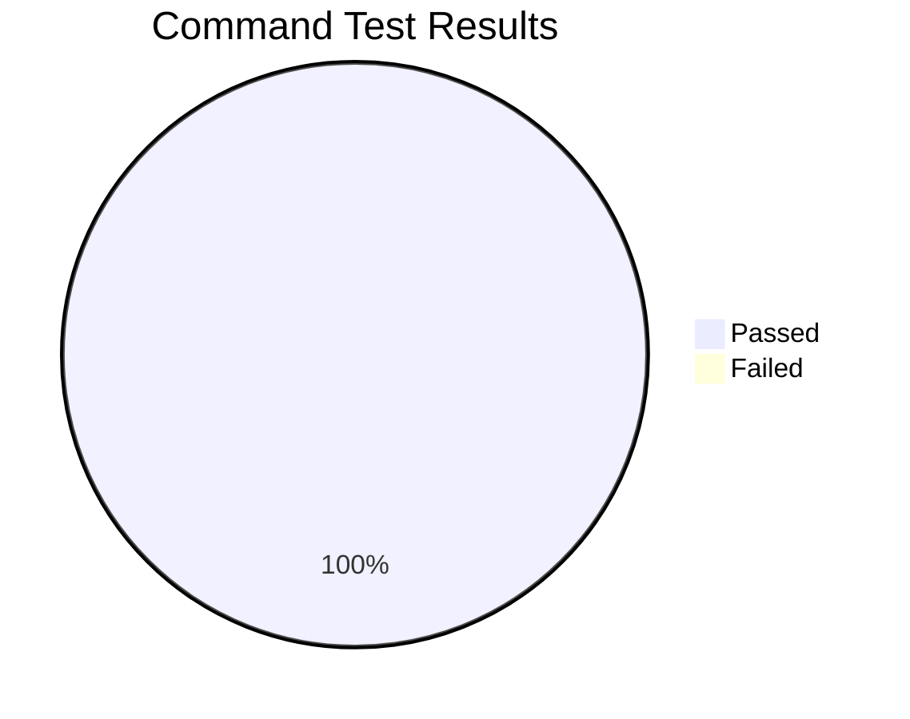

# Ethos CLI Test Results

**Date:** January 29, 2026  
**Environment:** Dev (`https://api.dev.ethos.network`)  
**Test User:** sethgho (profileId: 26)

## Test Summary

## Command Test Matrix

| Category | Command | Status | Notes |
|----------|---------|--------|-------|
| **User** | `user info` | ✅ PASS | |
| | `user search` | ✅ PASS | |
| | `user activity` | ✅ PASS | |
| **Score** | `score lookup` | ✅ PASS | |
| | `score status` | ✅ PASS | |
| **XP** | `xp seasons` | ✅ PASS | |
| | `xp rank` | ✅ PASS | |
| **Vouch** | `vouch list` | ✅ PASS | |
| | `vouch info` | ✅ PASS | Tested with ID 182 |
| | `vouch mutual` | ✅ PASS | |
| **Slash** | `slash list` | ✅ PASS | |
| | `slash info` | ✅ PASS | Tested with ID 195 |
| **Vote** | `vote list` | ✅ PASS | |
| | `vote stats` | ✅ PASS | |
| **NFT** | `nft list` | ✅ PASS | Fixed: now resolves username to userkey |
| **Validator** | `validator list` | ✅ PASS | |
| | `validator info` | ✅ PASS | |
| | `validator sales` | ✅ PASS | |
| **Auction** | `auction list` | ✅ PASS | |
| | `auction info` | ✅ PASS | |
| | `auction active` | ✅ PASS | |
| **Market** | `market list` | ✅ PASS | |
| | `market info` | ✅ PASS | |
| | `market featured` | ✅ PASS | |
| | `market holders` | ✅ PASS | |
| **Listing** | `listing list` | ✅ PASS | |
| | `listing info` | ✅ PASS | |
| | `listing voters` | ✅ PASS | |
| **Broker** | `broker list` | ✅ PASS | |
| | `broker info` | ✅ PASS | |
| **Config** | `config get` | ✅ PASS | |
| | `config set` | ✅ PASS | |
| | `config path` | ✅ PASS | Fixed: added parse() call |

## Bugs Fixed This Session

### 1. `nft list` - Input validation failed (400 error)
**Problem:** Command passed raw username directly to API instead of resolving to userkey format.  
**Fix:** Added `resolveUser()` call to convert identifier to user, then `getPrimaryUserkey()` to get proper userkey format.  
**File:** `src/commands/nft/list.ts`

### 2. `config path` - Unparsed command warning
**Problem:** oclif warning about command not parsing arguments.  
**Fix:** Added `await this.parse(ConfigPath)` call.  
**File:** `src/commands/config/path.ts`

### 3. API Error Handler - "Body has already been read" (fixed earlier)
**Problem:** Error handler called `response.json()` then `response.text()` on same response.  
**Fix:** Read text first, then parse as JSON.  
**File:** `src/lib/api/echo-client.ts`

### 4. Vote/VoteStats interfaces - Type mismatch (fixed earlier)
**Problem:** Interface didn't match actual API response structure.  
**Fix:** Updated `Vote` and `VoteStats` interfaces.  
**File:** `src/lib/api/echo-client.ts`

### 5. API Endpoints - Wrong version (fixed earlier)
**Problem:** Several endpoints used `/api/v1` instead of `/api/v2`.  
**Affected:** `votes`, `mutual-vouchers`, `score/status`  
**File:** `src/lib/api/echo-client.ts`

## Test Data Used

| Item | Value |
|------|-------|
| Test User | sethgho |
| Profile ID | 26 |
| Vouch ID | 182 |
| Slash ID | 195 |
| Validator Token | 1 |
| Broker Post ID | 197 |
| Listing ID | 1 |
| Auction ID | 1, 10 |

## Commits Made

1. `a5b017f` - feat: add config and validator commands, simplify configuration
2. `679b11a` - fix: update votes API to v2 and fix response types
3. (pending) - fix: nft list resolve username, config path parse warning
